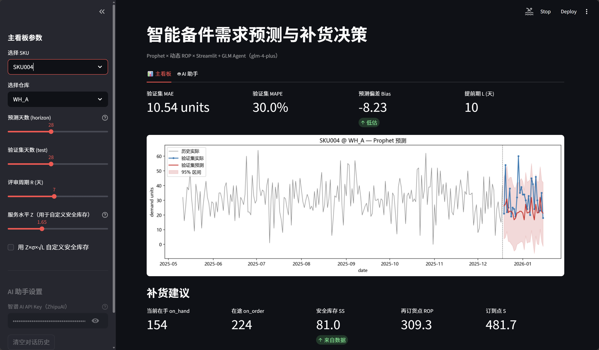
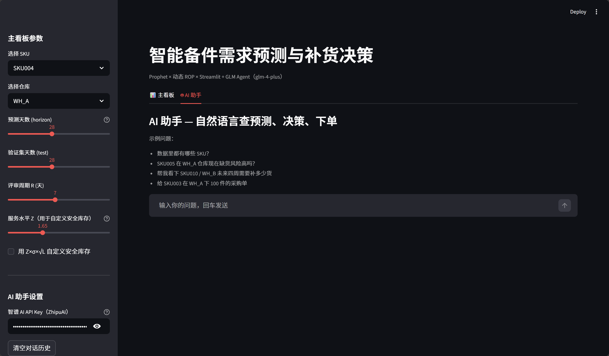
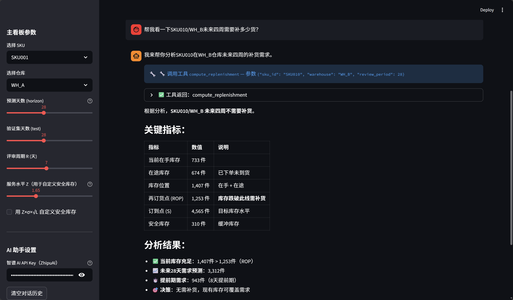
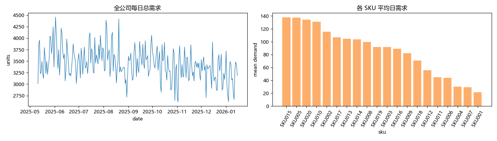
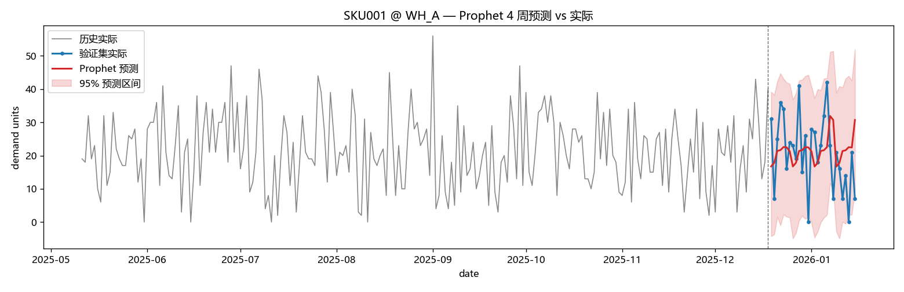
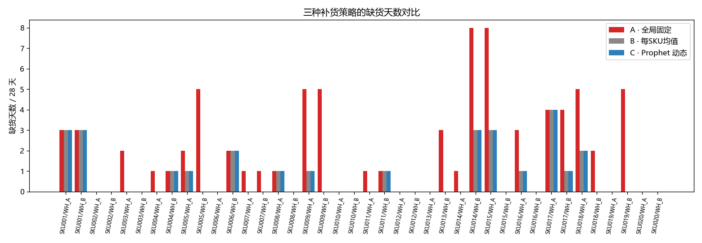

# 智能备件需求预测与补货决策（AI + 供应链 MVP）

这是一个面向备件库存管理的端到端应用。系统根据 SKU 和仓库的日级历史数据，使用 Prophet 预测需求，并结合动态再订货点策略生成补货建议；用户也可以通过 AI 助手用自然语言查询库存、预测需求和模拟下单。

项目包含 Python 分析脚本、Streamlit 交互看板和 AI Agent 工具层。主看板无需 API Key 即可使用。

---

## 1. 项目功能

### 1.1 核心功能

- **需求预测**：按 SKU 和仓库建立 Prophet 模型，展示历史需求、预测结果和预测区间。
- **补货建议**：根据提前期需求、安全库存、在手库存和在途库存，计算再订货点、订到点及建议下单量。
- **参数调整**：可以在主看板中修改预测天数、验证集天数、库存评审周期和安全库存计算方式。
- **AI 助手**：通过自然语言查询库存状态、未来需求及补货建议，并支持沙盒模拟下单。
- **离线分析**：批量处理全部 SKU/仓库组合，导出预测指标、补货建议和策略对比结果。

推荐的操作顺序：选择 SKU 和仓库 → 查看未来需求 → 查看补货建议 → 按业务情况调整参数 → 使用 AI 助手进一步查询。

### 1.2 系统界面

#### 主看板

主看板展示 Prophet 需求预测、库存状态和补货建议。



#### AI 助手

AI 助手提供示例问题、对话输入框和智谱 AI API Key 配置入口。



#### Agent 工具调用测试

用户提出自然语言问题后，Agent 可以调用 `compute_replenishment` 等工具，并返回结构化的补货决策。



---

## 2. 主看板使用说明

### 2.1 需求预测

在左侧选择 SKU 和仓库后，系统会按对应的历史日需求训练 Prophet 模型。预测图包括：

- **历史实际**：模型训练使用的历史需求。
- **验证集实际与预测**：用于观察模型在已知历史区间内的预测效果。
- **未来预测**：用于支持库存计划的未来需求趋势。
- **95% 预测区间**：表示预测的不确定范围，区间越宽说明不确定性越高。

实际使用时，应重点关注未来预测的方向、峰值和波动范围。验证集 MAE、MAPE 和 Bias 是模型测试信息，用于辅助判断预测是否可靠，不是最终的补货结论。

### 2.2 补货建议

系统使用周期评审 `(R, s, S)` 策略：

- **库存位置** = 在手库存 `on_hand` + 在途库存 `on_order`
- **再订货点 ROP** = 提前期预测需求 + 安全库存
- **订到点 S** = 再订货点 ROP + 评审周期预测需求
- 当库存位置低于 ROP 时，系统建议将库存补充到 S

| 结果 | 含义 | 使用建议 |
|---|---|---|
| 当前在手 `on_hand` | 当前可用库存 | 应替换为企业最新库存数据 |
| 在途 `on_order` | 已下单但尚未到货的数量 | 应与采购订单或 ERP 在途数据保持一致 |
| 安全库存 SS | 应对需求和交付波动的缓冲库存 | 可使用数据中的既有值，也可按服务水平重新计算 |
| 再订货点 ROP | 触发补货的库存位置阈值 | 库存位置低于该值时需要考虑下单 |
| 订到点 S | 本次补货后的目标库存位置 | 用于计算建议下单量 |
| 建议下单量 | 按当前参数计算出的建议采购数量 | 下单前还需结合最小起订量、包装量、预算和供应商产能审核 |

当前 `place_order` 仅执行沙盒模拟，将记录写入 `outputs/sandbox_orders.log`，不会连接真实采购系统。

---

## 3. 数据准备

项目默认使用 `inventory_replenishment_timeseries_10000.csv`，包含 20 个 SKU、2 个仓库和约 10,000 条日级记录。

主看板和 AI 助手直接读取该文件。接入实际业务数据时，最简单的方式是先备份示例文件，再用同名 CSV 替换它，并保持字段名和数据类型一致。

### 3.1 主要字段

| 字段 | 作用 | 是否建议替换为实际数据 |
|---|---|---|
| `date` | 业务日期 | 是 |
| `sku_id` | 备件或物料编码 | 是 |
| `warehouse` | 仓库编码 | 是 |
| `demand_units` | 当日实际需求量，也是预测目标 | 是 |
| `on_hand_units` | 当日在手库存 | 是，保证目标决策日记录准确 |
| `on_order_units` | 当日在途库存 | 是，保证目标决策日记录准确 |
| `lead_time_days` | 采购提前期 | 是，可按供应商或物料维护 |
| `safety_stock_units` | 业务设定的安全库存 | 可选；也可在看板中启用自定义计算 |
| `holiday_flag` | 节假日标记，通常为 0/1 | 按实际业务日历修改 |
| `promo_flag` | 促销或特殊事件标记，通常为 0/1 | 按实际业务场景修改 |
| `arrivals_units` | 当日到货量，主要用于策略仿真 | 运行完整分析脚本时需要 |
| `stockout`、`fill_rate` | 历史服务水平信息 | AI 库存查询和效果分析时使用 |

数据应按“每个 SKU × 仓库每天一行”组织，`date` 应可解析为日期。每个组合应保留足够的连续历史记录；当前看板要求记录数至少大于“验证集天数 + 30 天”。

当前主看板为了演示历史回测，将验证区间前一天作为决策日，并读取该日的在手、在途、提前期和安全库存，而不是直接读取 CSV 最后一行。若用于当天的实际补货决策，应先完成历史验证，再将 `02_streamlit_app.py` 中的决策快照改为最新业务日，并同步调整预测起点。AI 助手的库存工具也采用相同的回测快照设计。

> 当前版本未提供文件上传控件。修改 CSV 后请重新启动应用；若仍显示旧数据，可清除 Streamlit 缓存后重新运行。

---

## 4. 快速开始

### 4.1 启动系统

#### 方式 A：一键启动

Windows 用户可以双击 `run.bat`，或在 PowerShell 中运行：

```powershell
.\run.bat
```

macOS / Linux 用户运行：

```bash
chmod +x run.sh
./run.sh
```

一键脚本会依次安装依赖、执行离线分析脚本并启动 Streamlit 看板。

#### 方式 B：使用 conda

```bash
conda env create -f environment.yml
conda activate supplychain
python 01_demand_forecast_and_replenishment.py
streamlit run 02_streamlit_app.py
```

#### 方式 C：使用 pip

```bash
pip install -r requirements.txt
python 01_demand_forecast_and_replenishment.py
streamlit run 02_streamlit_app.py
```

启动后访问 `http://localhost:8501`。停止服务时在终端按 `Ctrl+C`。

> 看板必须使用 `streamlit run 02_streamlit_app.py` 启动，不能直接执行 `python 02_streamlit_app.py`。

如果只想使用已有数据进入看板，可以在依赖安装完成后直接运行 Streamlit；如果修改了数据并希望重新生成全部分析产物，请先执行离线分析脚本。

### 4.2 AI 助手

主看板不需要 API Key。AI 助手使用智谱 GLM，需要先申请智谱 AI API Key。

1. 在智谱开放平台申请 API Key：<https://open.bigmodel.cn/usercenter/apikeys>
2. 临时使用时，在应用侧栏的“智谱 AI API Key”输入框中粘贴 Key。
3. Windows 用户也可以设置用户级环境变量：

```powershell
[Environment]::SetEnvironmentVariable("ZHIPUAI_API_KEY", "你的key", "User")
```

重新打开终端并启动应用后，AI 助手会自动读取该环境变量。请勿将 Key 写入源代码或提交到 Git。

可以尝试以下问题：

- `SKU005 在 WH_A 的当前库存状态怎么样？`
- `预测 SKU001 在 WH_B 未来 28 天的需求。`
- `SKU010 在 WH_A 是否需要补货？建议补多少？`
- `列出当前可查询的 SKU 和仓库。`

默认模型在 `agent_core.py` 的 `MODEL` 中配置。调整模型时，请确认目标模型支持当前的工具调用方式。

### 4.3 修改配置

#### 主看板参数

| 参数 | 默认值与范围 | 作用 | 实际使用建议 |
|---|---|---|---|
| 选择 SKU | 数据文件中的 SKU | 指定要分析的物料 | 选择实际需要制定库存计划的物料 |
| 选择仓库 | 数据文件中的仓库 | 指定库存地点 | 不同仓库应分别预测和决策 |
| 预测天数 `horizon` | 默认 28 天；7～56 天 | 控制训练截止点之后的预测观察范围 | 大于验证集天数时，图中才会额外显示超出已知数据的未来区间 |
| 验证集天数 `test` | 默认 28 天；7～56 天 | 留出最近一段历史数据评估模型 | 属于模型测试参数；日常决策可保留默认值 |
| 评审周期 R | 默认 7 天；1～14 天 | 表示多久检查一次库存，也影响订到点 S | 按实际补货频率设置，如每日、每周或双周评审 |
| 服务水平 Z | 默认 1.65 | 将目标服务水平转换为安全系数 | 1.28、1.65、1.96、2.33 分别约对应 90%、95%、97.5%、99% |
| 自定义安全库存 | 默认关闭 | 开启后使用 `Z × 日需求标准差 × √提前期` | 有明确服务水平策略时开启；否则使用 CSV 中的 `safety_stock_units` |

这些参数只影响当前主看板会话，不会改写原始 CSV。

#### 代码级配置

| 参数 | 所在文件 | 作用 |
|---|---|---|
| `DATA_PATH` | `01_demand_forecast_and_replenishment.py`、`02_streamlit_app.py`、`agent_tools.py` | 数据文件路径；更换文件名时需保持三处一致 |
| `OUTPUT_DIR` | `01_demand_forecast_and_replenishment.py` | 分析结果输出目录 |
| `FORECAST_HORIZON` | `01_demand_forecast_and_replenishment.py` | 批量预测天数 |
| `TEST_HORIZON` | `01_demand_forecast_and_replenishment.py`、`agent_tools.py` | 模型验证区间长度 |
| `REVIEW_PERIOD` | `01_demand_forecast_and_replenishment.py`、`agent_tools.py` | 默认库存评审周期 |
| `GLOBAL_THRESHOLD`、`GLOBAL_ORDER_QTY` | `01_demand_forecast_and_replenishment.py` | 仅用于与传统固定补货策略对比 |
| `MODEL` | `agent_core.py` | AI 助手使用的智谱模型 |

修改代码级配置后需要重启程序；修改批量分析参数后，还需重新运行 `01_demand_forecast_and_replenishment.py` 才会生成新的输出结果。

---

## 5. 项目结构

```text
spare-parts-forecast-replenishment/
├── README.md
├── run.bat
├── run.sh
├── requirements.txt
├── environment.yml
├── 01_demand_forecast_and_replenishment.py   # 批量预测、补货分析与测试
├── 02_streamlit_app.py                       # 主看板与 AI 助手界面
├── agent_tools.py                            # Agent 可调用的业务工具
├── agent_core.py                             # GLM 工具调用流程
├── inventory_replenishment_timeseries_10000.csv
├── sample_outputs/                           # 项目示例结果
├── outputs/                                  # 当前运行生成的结果
└── run_logs/                                 # 当前运行日志
```

离线分析完成后，重点业务输出包括：

- `outputs/replenishment_recommendation.csv`：全部 SKU/仓库的补货建议。
- `outputs/sku_warehouse_summary.csv`：各 SKU/仓库的需求与库存汇总。
- `outputs/validation_metrics_per_sku.csv`：模型验证指标，仅用于评估预测质量。
- `outputs/strategy_comparison.csv`：补货策略测试结果。

---

## 6. 计算方法

### 6.1 需求预测

- 每个 SKU/仓库组合单独建立 Prophet 模型。
- 使用周内季节性，不启用年季节性。
- 使用 `holiday_flag` 和 `promo_flag` 作为额外回归变量。
- 输出点预测和 95% 预测区间。

### 6.2 补货决策

系统采用动态 `(R, s, S)` 周期评审策略：

```text
ROP = 未来 L 天预测需求 + 安全库存
S   = ROP + 未来 R 天预测需求
库存位置 = 在手库存 + 在途库存
```

当库存位置小于 ROP 时，`建议下单量 = S - 库存位置`。其中 L 为采购提前期，R 为库存评审周期。

### 6.3 AI 助手工具

| 工具 | 作用 |
|---|---|
| `list_skus` | 列出可用的 SKU/仓库组合 |
| `get_inventory_status` | 查询当前库存、安全库存、提前期和历史服务水平 |
| `forecast_demand` | 预测指定时间范围内的需求 |
| `compute_replenishment` | 计算 ROP、订到点和建议下单量 |
| `place_order` | 执行沙盒模拟下单，不触发真实采购 |

---

## 7. 测试与参考结果

本节数据用于说明当前示例数据上的测试表现，不应替代实际业务数据上的重新验证。

| 测试指标 | 示例结果 | 来源 |
|---|---:|---|
| 验证集相对 MAE | 29.98% | `sample_outputs/headline_metrics.csv` |
| 验证集 sMAPE | 31.75% | `sample_outputs/validation_metrics_per_sku.csv` |
| Prophet 相对 naive 均值 MAE 改善 | +5.34% | `sample_outputs/headline_metrics.csv` |
| 动态策略相对固定策略的缺货天数降幅 | 64.94% | `sample_outputs/headline_metrics.csv` |
| Fill Rate | 94.88% → 98.33% | `sample_outputs/headline_metrics.csv` |

**每日总需求与各 SKU 平均需求**



**Prophet 预测与实际需求对比**



**三种补货策略的缺货天数对比**



重新生成测试结果：

```bash
python 01_demand_forecast_and_replenishment.py
```

新结果写入 `outputs/`，不会覆盖 `sample_outputs/`；运行日志写入 `run_logs/YYYYMMDDHHMM.txt`。

---

## 8. 已知限制

- 示例数据的需求相对平稳，Prophet 相对简单基线的改善有限；实际部署前应按 SKU 比较多种预测模型。
- 备件需求可能具有间歇性，不能只依赖 MAPE，应结合 MAE、sMAPE、Bias 和业务缺货成本评估。
- 当前系统默认未来的节假日和促销标记为 0；实际使用时应接入未来业务日历。
- 当前验证方式为单次留出验证，生产环境建议使用滚动时间窗验证。
- 补货建议尚未自动考虑最小起订量、包装倍数、仓储容量、采购预算和供应商产能。
- AI 助手的下单功能仅用于测试，不会写入 ERP 或真实采购系统。

---

## 9. 后续计划

- [x] Prophet 需求预测与动态 ROP
- [x] Streamlit 主看板
- [x] AI 对话助手与工具调用
- [ ] 增加 Croston-SBA、SARIMAX、LightGBM 等模型并按 SKU 自动选择
- [ ] 纳入持有成本、缺货成本和订购成本
- [ ] 支持在界面中上传数据并配置字段映射
- [ ] 对接 ERP/WMS 的库存和采购数据

---

## 10. License

本项目采用 MIT License，详见 [LICENSE](LICENSE)。

## 11. 联系方式

如有问题，请提交 issue。

> 示例数据来自 Kaggle 公开数据集；测试指标可通过仓库中的脚本重新生成。
